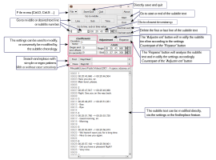

# SubAdjust

**A GUI and command line tool to correct the timeline of subtitles in .srt format**

The GUI aims to be self-explanatory, but some indications might be useful :


It also has an inline help saying :

```
Subadjust version 1.0.0
Copyright © D. LALANNE - MIT License - No warranty of any kind.
A tool that allows to process subtitles files.
Using the batch mode allows processing at the command line or by script.
Meanwhile using the GUI mode adds a search and replace feature with regular expressions.

Usage: subadjust [OPTIONS] ARGUMENT
Available options
 -V, --version             Output version information and exit.
 -H, --help                Display this message and exit. This option implies -V/--version.

 -f, --file ARG            Name of the file to read. It is the same than directly passing a file name without this option.
 -g, --gui-mode            Process the input file and show it with the gui.
 -c, --batch-mode          Process the input the file and print the result.

 -b, --begin-time ARG      Change the beginning time stamp to the provided argument.
 -e, --end-time ARG        Change the end time stamp to the provided argument.
 -k, --duration-coeff ARG  Change the duration coefficient to the provided argument.
 -a, --start-offset ARG    Change the start offset to the provided argument.
 -s, --stop-offset ARG     Change the stop offset to the provided argument.
These 5 previous options are processed after reading the file and have effect in both GUI and batch mode.

 -o, --output-file ARG     Write the processing result into the file whose name is passed as argument.
 -i, --modify-input        Write the processing result into the same input file.
These 2 previous options only have meaning in batch mode, they are ignored in GUI mode.

 -x, --xpos ARG            Set the x origin of the subadjust window.
 -y, --ypos ARG            Set the y origin of the subadjust window.
 -w, --width ARG           Set the width of the subadjust window.
 -h, --height ARG          Set the height of the subadjust window.
 -t, --theme ARG           Set the graphic theme to use. It is a string to choose between one of :
    classic, aero, metro, aqua, greybird, ocean, blue, olive, rose_gold, dark, brushed_metal or high_contrast.
These 5 previous options only have effect in GUI mode. In this case, they have precedence and will update what is defined in the configuration file.
The configuration file is located there : "C:\Users\dplal\AppData\Roaming\dplalanne.fr\subadjust.prefs".

 -l, --log-level ARG       Set the level of the log messages to display :
    ALL: All the messages.
    TRACE: Almost all messages, at least those finer than the INFO level.
    INFO: Informational messages that highlight the application's progress at a coarser level.
    DEBUG: Fine-grained events, the most useful for debugging an application.
    WARN: Potentially dangerous situations.
    ERROR: Errors that might still allow the application to continue running.
    FATAL: Very serious errors that will likely cause the application to crash.
    OFF: Disables logging.
 -m, --log-file ARG        Define the file where log messages will be stored.
    Default it to store them in the following file C:\UnixTools\msys64\tmp\subadjust.log
    The special value 'console' will allows to output the log messages to the console, if possible.
These 2 previous options have precedence on the environments variable LOG and LOGFILE.
If none of these are defined, the default is to send the WARN and following log messages into the file "C:\UnixTools\msys64\tmp\subadjust.log".
```

It compiles and run under both Windows (With Visual Studio and g++) and Linux (With g++), thanks to [FLTK](https://www.fltk.org).
Should behave equal under macOS ...
