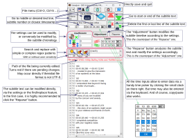

# SubAdjust

##### ***A graphical and command line tool to modify the timeline of subtitles files in SubRip (.srt) and WEBVTT (.vtt) format***

<sup>*Actually available in 3 languages : english, french and spanish. But others can easily be added.*</sup>

Can be used as a file converter between SubRip and WEBVTT format.

Also allows to export to CSV format.

##### ***You can download a binary version of this tool in the "[Release](https://github.com/2nil-web/subadjust/releases)" link.***

<sup>*Available to five Linux  distros (Arch , Debian , Fedora , OpenSUSE , Ubuntu ) and Windows .*</sup>
<sup>*It should also be possible to build and deliver it for macOS .*</sup>

After the download, just unzip and run it with .srt files.

### ***The Graphical User Interface aims to be self-explanatory***

***But some indications might be useful***



*<sup>Many tooltips will guide you during the use of this GUI.</sup>*

<ins>***There is also an inline help :***</ins>

```
Subadjust version 1.1.1
Copyright © D. LALANNE - Licence MIT - Sans garantie d'aucune sorte.
Outil d'édition des fichiers de sous-titres.
Le mode batch permet le traitement en ligne de commande ou par script.
Le mode GUI ajoute une fonction de recherche et de remplacement avec des expressions régulières.

Utilisation: subadjust [OPTIONS] ARGUMENT
Options disponibles
 -V, --version             Affiche les informations de version et sort.
 -H, --help                Affiche ce message et sort. Cette option implique l'option -V.

 -f, --input file ARG      Nom du fichier à lire. Identique à un passage direct du nom de fichier  en argument sans cette option.
 -g, --gui-mode            Traiter le fichier d'entrée et l'afficher dans l'interface graphique. C'est le comportement par défaut.
 -c, --batch-mode          Traiter le fichier d'entrée et afficher le résultat.

 -b, --begin-time ARG      Modifie l'horodatage de début selon l'argument fourni.
 -e, --end-time ARG        Modifie l'horodatage de fin selon l'argument fourni.
 -k, --duration-coeff ARG  Modifie le coefficient de durée selon l'argument fourni.
 -a, --start-offset ARG    Modifie le décalage de début selon l'argument fourni.
 -s, --stop-offset ARG     Modifie le décalage de fin selon l'argument fourni.
Ces cinq options précédentes sont traitées après la lecture du fichier et ont un effet à la fois en mode GUI et en mode batch.

 -o, --output-file ARG     Traite le fichier d'entrée en mode batch et l'écrit dans le fichier dont le nom est passé en argument.
    Selon l'extension du fichier de sortie, il peut être écrit au format SubRip, WEBVTT ou même CSV.

 -i, --modify-input        Écrit le résultat du traitement dans le même fichier d'entrée. N'a de sens qu'en mode batch, est silencieusement ignoré en mode GUI.

 -r, --reset-pref          Réinitialiser les préférences aux valeurs par défaut.
 -x, --xpos ARG            Définit l'origine en x de la fenêtre subadjust
 -y, --ypos ARG            Définit l'origine en y de la fenêtre subadjust
 -w, --width ARG           Définit la largeur de la fenêtre subadjust.
 -h, --height ARG          Définir la hauteur de la fenêtre subadjust.
 -t, --theme ARG           Définir le thème graphique à utiliser. Il s'agit d'une chaîne de caractères permettant de choisir parmi les options suivantes :
 classic, aero, metro, aqua, greybird, ocean, blue, olive, rose_gold, dark, brushed_metal ou high_contrast.
Ces 5 options précédentes n'ont d'effet qu'en mode GUI. Dans ce cas, elles ont priorité et mettront à jour les valeurs définies dans le fichier de configuration.
Le fichier de configuration se trouve ici : "C:\Users\dplal\AppData\Roaming\dplalanne.fr\subadjust.prefs".

 -l, --log-level ARG       Définir le niveau d'affichage des messages de journalisation :
    ALL   Tous les messages.
    TRACE Presque tous les messages. au moins ceux de niveau plus fin que INFO.
    INFO  Messages d'information qui mettent en évidence la progression de l'application  à un niveau plus grossier.
    DEBUG Événements précis, les plus utiles pour le débogage d'une application.
    WARN  Situations potentiellement dangereuses.
    ERROR Erreurs qui peuvent encore permettre à l'application de continuer à fonctionner.
    FATAL Erreurs très graves qui entraîneront probablement le 'plantage' de l'application.
    OFF   Désactive la journalisation.
 -m, --log-file ARG        Définissez le fichier où les messages de journalisation seront stockés.
    Par défaut, ils seront stockés dans le fichier suivant C:\UnixTools\msys64\tmp\subadjust.log
    La valeur spéciale 'console' permet d'afficher les messages de journalisation directement dans la console, quand c'est possible.
Si aucune de ces options n'est définie, le comportement par défaut consiste à envoyer l'avertissement et les messages de journalisation suivants dans le fichier "subadjust.log".
```

### ***Thanks and copyrights:***

- To [Bill Spitzak](https://github.com/spitzak) and others, of course, for the wonderful [FLTK](https://www.fltk.org) tool.
- To [**Rangi42**](https://github.com/Rangi42), [**dannye**](https://github.com/dannye) and [Remy Oukaour](https://github.com/roukaour) for the fltk graphical theme enhancement, which I've somewhat hacked.

### ***Technical insight:***

It compiles and run under both Windows (With Visual Studio and g++) and Linux (With g++), thanks to FLTK.

There is a "help" option in the Makefile that roughly explain the build and delivery workflow.

Although untested, this process should work identically under macOS, provided the necessary prerequisites are met.

###### Prerequisites to the build:

- A posix environment:
   [Linux](https://www.kernel.org/) of course.
   And for [Windows]([http://windows.microsoft.com), preferably [msys2](https://www.msys2.org) but [cygwin](https://www.cygwin.com/) should also work.
- [FLTK](https://www.fltk.org/)
- [g++](https://gcc.gnu.org)  (For Windows and linux)
- [ImageMagick](https://imagemagick.org)
- [Inkscape](https://inkscape.org)
- [libjpeg](https://www.ijg.org)
- [librsvg2](https://gitlab.gnome.org/GNOME/librsvg)
- [make](https://www.gnu.org/s/make)
- [pandoc](https://pandoc.org/)
- [gettext](https://www.gnu.org/s/gettext)
- [libiconv](https://www.gnu.org/software/libiconv)
- [Visual C++](https://docs.microsoft.com/fr-fr/cpp/) should be enough if you only want to compile under Windows, as .slnx/.vcxproj files are provided.

###### To do:

- *Release with a setup and/or package, actually it is only a zip file.*
